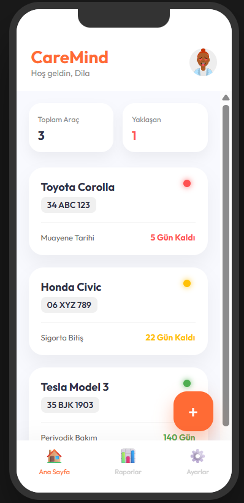
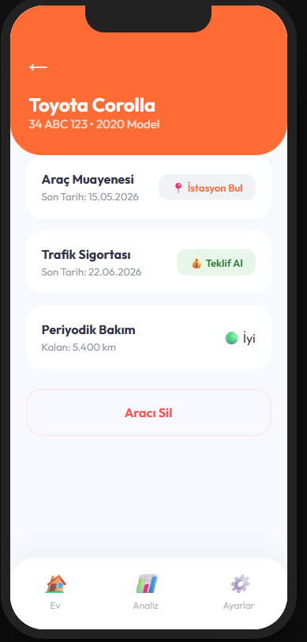
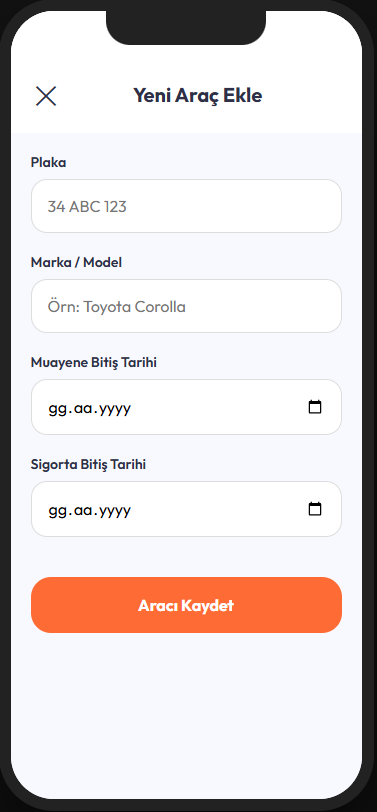
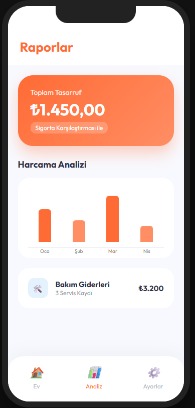
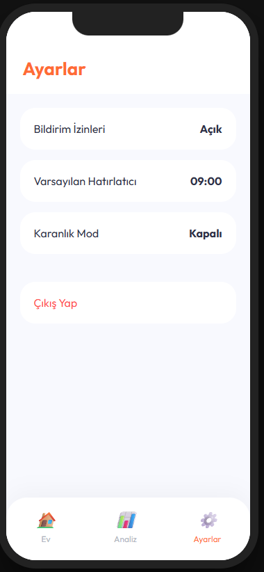

# CaReminder — Muayene & Sigorta Takip Uygulaması

## Proje Hedefi
Türkiye'deki araç sahiplerinin muayene, sigorta, kasko ve bakım tarihlerini kolayca takip edebilmesini sağlayan, tamamen çevrimdışı çalışan bir mobil uygulama.

## MVP Özellikleri
- Araç ekleme, düzenleme, silme
- Kritik tarihler için bildirimler (60 ve 30 gün kala)
- Sigorta teklif ekranı (affiliate link)
- Tüm veriler cihazda, backend yok

## Uygulama Görselleri

  <h3>Ana Sayfa (Dashboard)</h3>
  
  
<i>Araç listenizi ve yaklaşan kritik tarihleri tek bakışta görün.</i>

   

  <h3>Araç Detayları</h3>
  
  
<i>Muayene, sigorta ve bakım detaylarını inceleyin, aksiyon alın.</i>

   

  <h3>Yeni Araç Ekleme</h3>
  
  
<i>Kolay ve hızlı bir şekilde yeni aracınızı sisteme dahil edin.</i>

   

  <h3>Raporlar ve Analiz</h3>
  
  
<i>Harcama analizi ve tasarruf istatistiklerinizi takip edin.</i>

   

  <h3>Ayarlar</h3>
  
  
<i>Bildirim ve uygulama tercihlerini kişiselleştirin.</i>

## Teknoloji Yığını
- React Native 0.73+ (Expo SDK 50+)
- TypeScript
- React Navigation v6
- AsyncStorage
- expo-notifications
- date-fns
- NativeWind (Tailwind CSS for RN)

## Klasör Yapısı (Planlanan)
- app/
- components/
- services/
- hooks/
- types/
- utils/
- constants/
- assets/

## Geliştirme Aşamaları
1. Proje kurulumu ve temel yapılandırma
2. Navigasyon ve ekran iskeletleri
3. Veri modeli ve servisler
4. Bildirim entegrasyonu
5. UI/UX ve testler

## Postman ve API Testleri Hakkında

## Backend ve API Testleri

Artık basit bir Node.js/Express backend ile araçlar için CRUD işlemleri yapılabilir. Tüm endpointler in-memory çalışır.

### API Endpointleri
- `GET    /araclar`   → Tüm araçları getir
- `POST   /araclar`   → Yeni araç ekle
- `PUT    /araclar/:id` → Araç güncelle
- `DELETE /araclar/:id` → Araç sil

### Postman ile Test
1. Sunucuyu başlat: `cd backend && npx ts-node-dev src/index.ts`
2. Postman'da aşağıdaki istekleri kullan:
	- GET  `http://localhost:3001/araclar`
	- POST `http://localhost:3001/araclar` (JSON body ile)
	- PUT  `http://localhost:3001/araclar/{id}`
	- DELETE `http://localhost:3001/araclar/{id}`

Daha fazla örnek ve test için `backend/API_TEST.md` dosyasına bakabilirsiniz.

## Mobil (caremind/)
- Expo SDK 54+ ve React Native 0.81+ ile kurulu.
- Bildirimler için `expo-notifications` kullanılıyor. SDK 53+ ile push bildirimleri için Expo Go yerine development build gereklidir.
- Android için native build almak için:
	1. `cd caremind`
	2. `npm install`
	3. `npx expo prebuild`
	4. `npx expo run:android`
- Bildirimler ve Linking için `app.json` içinde gerekli izinler ve ayarlar mevcut.
- Geliştirme sırasında hata alırsanız, React/React Native ve Expo sürümlerinin uyumlu olduğundan emin olun.

## Backend (backend/)
- Basit bir Node.js/Express API mevcut.
- CRUD işlemleri için endpointler ve örnekler yukarıda belirtildiği gibi çalışıyor.

## Genel
- Proje iki ana klasörden oluşuyor: `caremind/` (mobil) ve `backend/` (API).
- Her iki klasörde de bağımsız `package.json` ve bağımlılıklar var.
- Katkı sağlamak için PR gönderebilirsiniz.

Her aşama tamamlandıkça bu dosya güncellenecektir.
