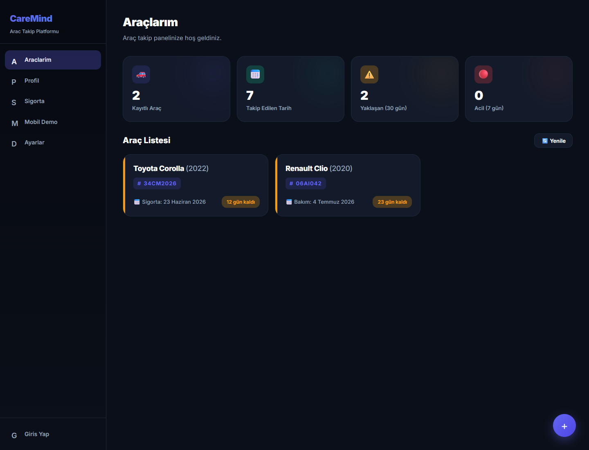
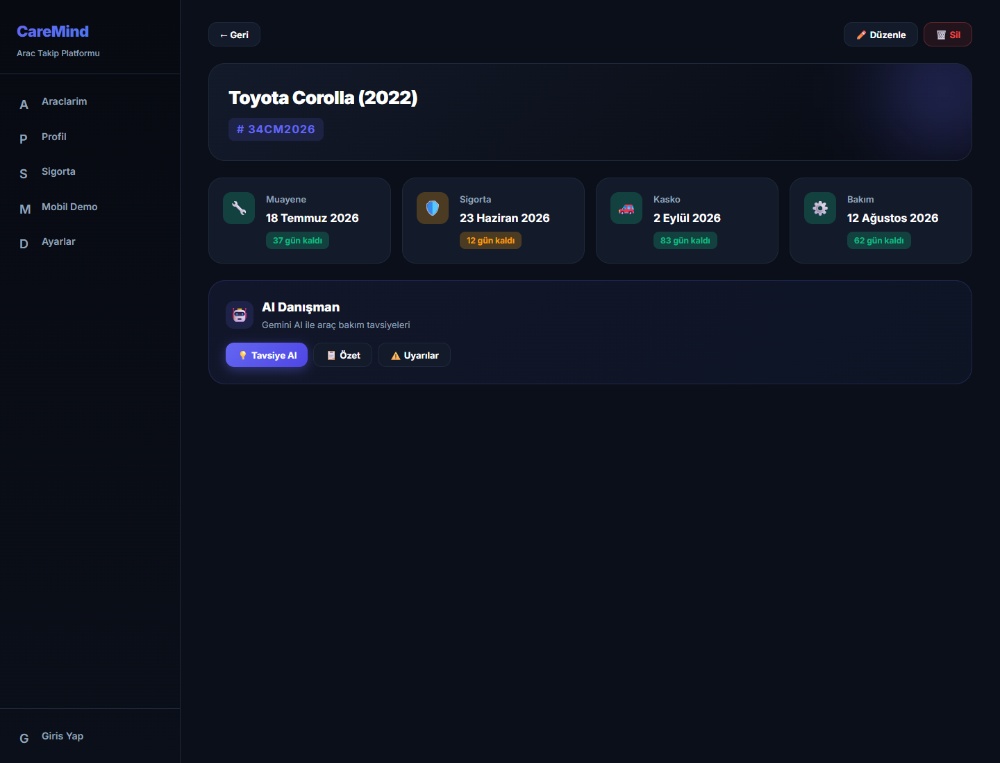
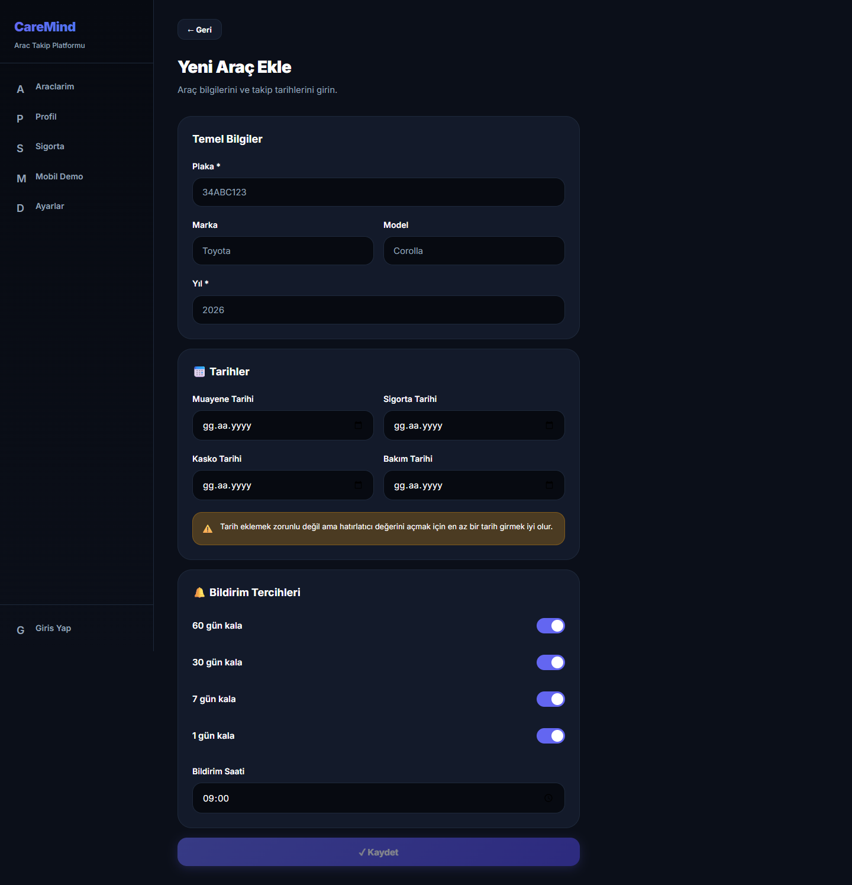
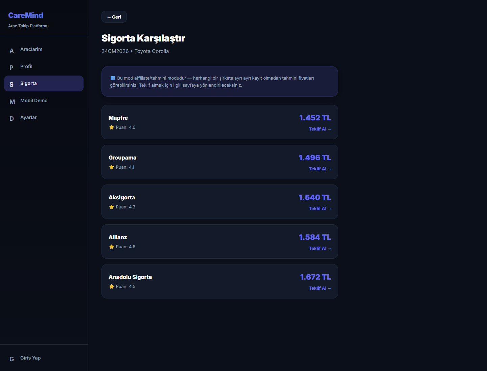
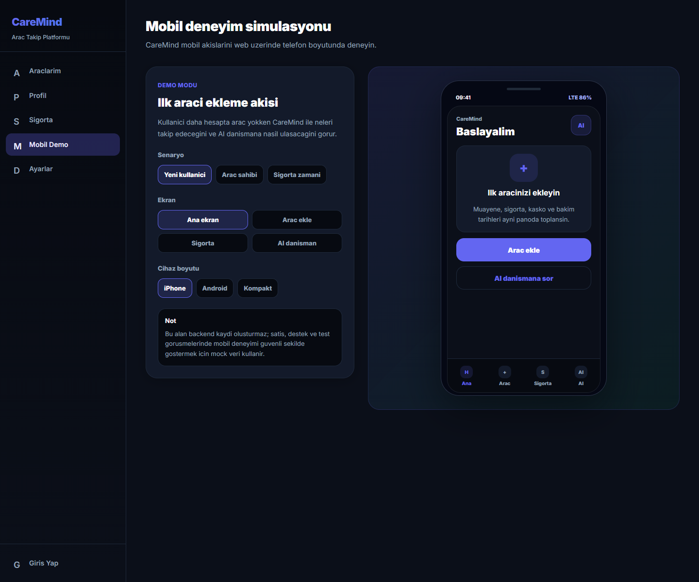

# CareMind

[Canlı Uygulama](https://app-preneur-upschool.onrender.com/)

CareMind; araç muayene, trafik sigortası, kasko ve bakım tarihlerini takip etmek için geliştirilen offline-first bir araç takip platformudur. Projede üç ana parça bulunur:

- `frontend/`: Expo + React Native mobil uygulaması.
- `web/`: Vite + React web arayüzü.
- `backend/`: Express + TypeScript API katmanı.

Uygulama temel araç takibini cihazda/localStorage veya AsyncStorage üzerinde sürdürebilir. Kullanıcı profil/e-posta ile giriş yaptığında backend üzerinden araç senkronizasyonu, AI danışman ve sigorta teklif akışları devreye girer.

Hazırlayan: Dila KEMER

## Öne Çıkan Özellikler

- Araç kaydı: plaka, marka, model, yıl ve takip tarihleri.
- Kritik tarih takibi: muayene, trafik sigortası, kasko ve bakım.
- Renkli durum sistemi: güvenli, yaklaşan ve acil tarihlerin hızlı ayrımı.
- Bildirim tercihleri: 60, 30, 7 ve 1 gün kala hatırlatma seçenekleri.
- Manuel yazmayı önleyen saat seçici: Bildirim saatleri için klavye ile yazmayı tamamen engelleyen, açılır menü (saat ve dakika ayrı) tabanlı modern saat seçici.
- Offline-first veri akışı: mobil tarafta AsyncStorage, web tarafta localStorage.
- Backend senkronizasyonu: giriş yapılan kullanıcıya göre araç verisi API ile eşlenir.
- Gerçek zamanlı Gemini AI danışmanı: Gelişmiş hata toleransı, güncel modeller (Gemini 2.0 Flash / 1.5 Flash / 1.5 Pro) ve esnek yanıt kontrolü ile gerçek araç verilerini yorumlayan akıllı asistan.
- Sigorta karşılaştırma: tahmini/affiliate mod ve gerçek sağlayıcı entegrasyonuna hazır yapı.
- Web demo ekranı: mobil deneyim akışlarını web üzerinde göstermek için mock demo.

## Klasör Yapısı

```text
caremind/
+-- backend/                 # Express API, AI servisi, sigorta teklif katmanı
+-- frontend/                # Expo/React Native mobil uygulama
+-- web/                     # Vite/React web paneli
+-- tests/                   # Backend ve frontend birim testleri
+-- prodocs/                 # PRD, plan, tech stack, design system, progress
+-- screenshoots/            # Mobil ve web ekran görüntüleri
+-- package.json             # Backend/test komutları
+-- DEPLOYMENT.md            # Üretim ortamı kontrol listesi
```

## Teknoloji Özeti

| Katman | Teknolojiler |
|---|---|
| Mobil | Expo SDK 54, React Native 0.81, Expo Router, TypeScript |
| Web | Vite, React 19, React Router, TypeScript |
| Backend | Node.js, Express, TypeScript |
| Veri | AsyncStorage, localStorage, dosya tabanlı/in-memory backend veri katmanı |
| AI | Google Gemini API |
| Bildirim | expo-notifications |
| Test | Jest, ts-jest |
| Dağıtım | Render, EAS Build, Vite static hosting |

## Hızlı Başlangıç

### 1. Gereksinimler

- Node.js 18 veya üzeri
- npm
- Mobil test için Expo Go veya development build
- AI özellikleri için Gemini API anahtarı

### 2. Ortam Değişkenleri

Kök dizinde `.env.example` dosyasını kopyalayın:

```bash
cp .env.example .env
```

Temel değişkenler:

```env
PORT=3001
NODE_ENV=development
CORS_ORIGIN=http://localhost:5173,http://localhost:8081,http://localhost:19006
DB_PERSISTENCE=file
DB_FILE_PATH=backend/data/caremind-db.json
GEMINI_API_KEY=your_gemini_api_key_here
GEMINI_MODEL=gemini-2.0-flash
ADMIN_API_KEY=change_me_for_production
EXPO_PUBLIC_API_URL=http://localhost:3001/api
EXPO_PUBLIC_SIGORTAM_URL=https://www.sigortam.net
```

### 3. Backend

```bash
npm install
npm run dev
```

Varsayılan API adresi:

```text
http://localhost:3001/api
```

Sağlık kontrolü:

```text
GET /api/saglik-kontrol
```

### 4. Web Uygulaması

```bash
cd web
npm install
npm run dev
```

Varsayılan web adresi:

```text
http://localhost:5173
```

Üretim build:

```bash
cd web
npm run build
```

### 5. Mobil Uygulama

```bash
cd frontend
npm install
npm start
```

Fiziksel cihazda test ederken `EXPO_PUBLIC_API_URL` değerinde `localhost` yerine bilgisayarın LAN IP adresi kullanılmalıdır.

## API Özeti

| Endpoint | Açıklama |
|---|---|
| `GET /api/saglik-kontrol` | Sunucu, AI ve araç sayısı sağlık kontrolü |
| `GET /api/araclar` | Giriş yapan kullanıcı için araç listesi |
| `POST /api/araclar` | Yeni araç ekleme |
| `GET /api/araclar/:id` | Araç detayı |
| `PUT /api/araclar/:id` | Araç güncelleme |
| `DELETE /api/araclar/:id` | Araç silme |
| `GET /api/raporlar/bildirim` | Yaklaşan/geciken tarih raporu |
| `GET /api/ai/tavsiye/:id` | Kayıtlı araç için AI tavsiyesi |
| `POST /api/ai/tavsiye` | İstemciden gelen araç nesnesiyle AI tavsiyesi |
| `POST /api/sigorta/teklifler` | Sigorta teklif sağlayıcılarını birleştirme |
| `DELETE /api/yonetim/tum-veriler` | Kullanıcı veya admin veri temizliği |

## Testler

Kök dizinde:

```bash
npm test
npm run test:backend
npm run test:frontend
npm run test:coverage
```

Web build kontrolü:

```bash
cd web
npm run build
```

## Dağıtım

- Backend: Render, Railway, Fly.io veya benzeri Node.js hostları.
- Web: Vite build çıktısı ile Render Static Site, Netlify, Vercel veya benzeri static hostlar.
- Mobil: EAS Build ile Android APK/AAB ve iOS TestFlight/App Store buildleri.

Ayrıntılı kontrol listesi için [DEPLOYMENT.md](./DEPLOYMENT.md) dosyasına bakın.

## Web Ekran Görüntüleri

Yeni web ekran görüntüleri `screenshoots/` klasörüne eklendi.

<div align="center">
  
  
  
  
  
</div>

## Mobil Ekran Görüntüleri

Mevcut mobil ekran görüntüleri:

<div align="center">
  
  
  
  
  
  
</div>

## Dokümantasyon

- [PRD.md](./prodocs/PRD.md): ürün kapsamı, kullanıcı akışları ve kabul kriterleri.
- [Plan.md](./prodocs/Plan.md): fazlar, görevler ve yol haritası.
- [tech-stack.md](./prodocs/tech-stack.md): teknoloji seçimleri ve mimari gerekçeler.
- [DesignSystem.md](./prodocs/DesignSystem.md): renkler, tipografi ve bileşen kuralları.
- [Progress.md](./prodocs/Progress.md): tamamlanan işler ve güncel durum.

## Notlar

- `screenshoots` klasör adı mevcut projede bu şekilde kullanıldığı için korunmuştur.
- Gerçek sigorta sağlayıcıları için `backend/INSURER_README.md` dosyasındaki ortam değişkenleri ayrıca yapılandırılmalıdır.
- AI tavsiyesi için backend tarafında geçerli `GEMINI_API_KEY` gerekir; anahtar yoksa AI çağrıları başarısız dönebilir.
